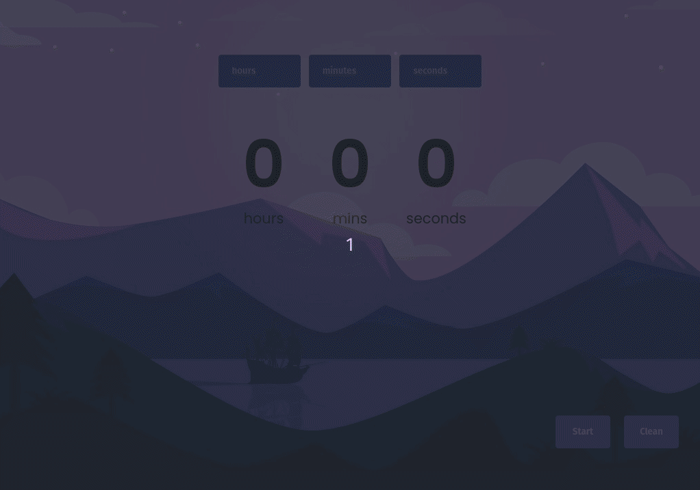

# CountDown Timer

On this project I intended to create a simple countdown timer to help on daily tasks by managing time and keeping users aware of time speeding.
Since it's a simple application, there was no reason for using any framework.

## Knowledges:
- DOM and Selector;
- Working with Elements;
- Events;

## Preview:

